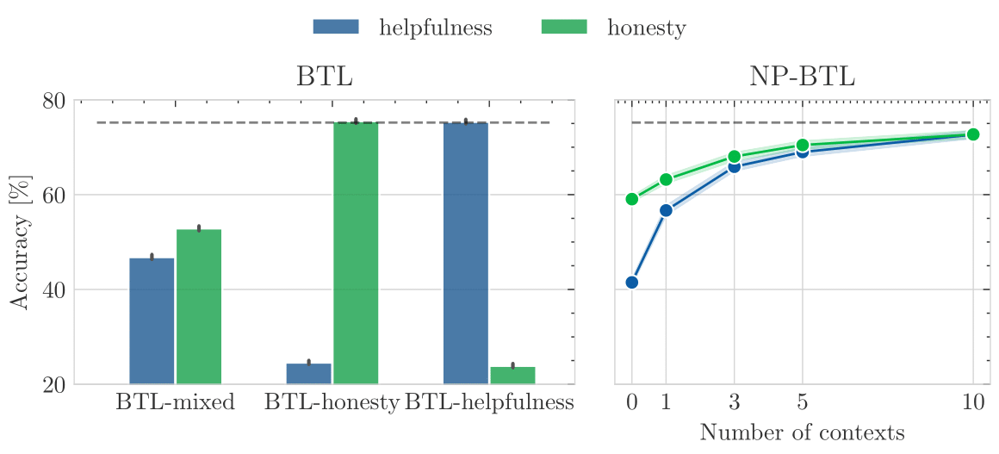

# Towards Few-shot Steerable Alignment: Code

<div align="left">

</div>

## Abstract
As large language models (LLMs) become increasingly embedded in everyday applications, ensuring their alignment with the diverse preferences of individual users has become a critical challenge. Currently deployed approaches typically assume homogeneous user objectives and rely on single-objective fine-tuning. However, human preferences are inherently heterogeneous, influenced by various unobservable factors, leading to conflicting signals in preference data. Existing solutions addressing this diversity often require costly datasets labelled for specific objectives and involve training multiple reward models or LLM policies, which is computationally expensive and impractical. In this work, we present a novel framework for few-shot steerable alignment, where users' underlying preferences are inferred from a small sample of their choices. To achieve this, we extend the Bradley-Terry-Luce model to handle heterogeneous preferences with unobserved variability factors and propose its practical implementation for reward modelling and LLM fine-tuning. Thanks to our proposed approach of functional parameter-space conditioning, LLMs trained with our framework can be adapted to individual preferences at inference time, generating outputs over a continuum of behavioural modes. We empirically validate the effectiveness of methods, demonstrating their ability to capture and align with diverse human preferences in a data-efficient manner.

## Getting Started

### Prerequisites
- Python 3.11
- CUDA toolkit 12.2 (for GPU support)
- ~85GB storage space (for LLM experiments)
- 80GB VRAM GPU (for LLM experiments)

### Installation

1. Clone the repository and navigate to the project directory:
```bash
git clone <repository_url>
cd <repository_name>
```

2. Create and activate a virtual environment with required dependencies:
```bash
conda env create -f environment.yaml
conda activate nppl
```

## Project Structure
```
.
├── assets/                     # Project images and diagrams
├── config/                     # Experiment configuration files
    ├── hh_dpo_config/              # Config files for helpfulness-honesty DPO runs
    ├── hh_reward_config/           # Config files for helpfulness-honesty reward runs
    ├── hht_dpo_config/             # Config files for helpfulness-honesty-truthfulness DPO runs
    ├── hht_reward_config/          # Config files for helpfulness-honesty-truthfulness reward runs
    ├── synthetic/                  # Config files for synthetic dataset runs
    └── synthetic_correlation/      # Config files for synthetic correlation runs
├── eval/                       # Evaluation scripts and notebooks
├── figures/                    # Generated plots and visualizations
├── outputs/                    # Hydra experiment outputs
├── saves/                      # Model checkpoints
└── src/                        # Core source code
```

## Running the Experiments

### 1. Synthetic Data Experiments

Generate and evaluate synthetic data for BTL, DPL, and NPPL models:

```bash
# Generate synthetic datasets
python data/gen_synthetic_data.py

# Train models
python src/train.py --config-path=../config/synthetic --config-name=config_btl
python src/train.py --config-path=../config/synthetic --config-name=config_dpl
python src/train.py --config-path=../config/synthetic --config-name=config_nppl

# Evaluate results
jupyter notebook eval/eval_synthetic.ipynb
```

### 2. LLM Experiments Setup

Prepare the UltraFeedback dataset:

```bash
# Prepare the datasets of pairs of responses
python data/prepare_uf_data.py

# Precompute Llama tokens
python data/tokenize_data.py --llm_name="meta-llama/Meta-Llama-3-8B" --max_length=1024

# Generate embeddings using Llama-3-8B
python data/embed_data.py 

# Process and split the dataset
python data/split_uf_data.ipynb

# Generate embedds with gemma-2b (used for DPO training only)
python data/tokenize_data.py --llm_name="Qwen/Qwen2.5-1.5B-Instruct" --max_length=512
```

### 3. Reward Model Training

#### Helpfulness vs. Honesty (HH) Dataset
Train different BTL reward models (`helpfulness`, `honesty`, `mixed`), and NP-PL reward model (`mixed`)
```bash
python src/train.py --config-path=../config/hh_reward_config --config-name=hh_config_btl_mixed
python src/train.py --config-path=../config/hh_reward_config --config-name=hh_config_btl_helpfulness
python src/train.py --config-path=../config/hh_reward_config --config-name=hh_config_btl_honesty
python src/train.py --config-path=../config/hh_reward_config --config-name=hh_config_nppl_mixed
```

#### Helpfulness vs. Honesty vs. Truthfulness (HHT) Dataset
Train different BTL reward models (`helpfulness`, `honesty`, `truthfulness`, `mixed`), and NP-PL reward model (`mixed`)
```bash
python src/train.py --config-path=../config/hht_reward_config --config-name=hht_config_btl_mixed
python src/train.py --config-path=../config/hht_reward_config --config-name=hht_config_btl_helpfulness
python src/train.py --config-path=../config/hht_reward_config --config-name=hht_config_btl_honesty
python src/train.py --config-path=../config/hht_reward_config --config-name=hht_config_btl_truthfulness
python src/train.py --config-path=../config/hht_reward_config --config-name=hht_config_nppl_mixed
```

### 4. DPO Training

#### Helpfulness vs. Honesty (HH) Dataset
Train different BTL-DPO models (`helpfulness`, `honesty`, `mixed`), and NP-DPO reward model (`mixed`)
```bash
python src/train.py --config-path=../config/hh_dpo_config --config-name=hh_dpo_config_btl_mixed
python src/train.py --config-path=../config/hh_dpo_config --config-name=hh_dpo_config_btl_helpfulness
python src/train.py --config-path=../config/hh_dpo_config --config-name=hh_dpo_config_btl_truthfulness
python src/train.py --config-path=../config/hh_dpo_config --config-name=hh_dpo_config_btl_honesty
python src/train.py --config-path=../config/hh_dpo_config --config-name=hh_dpo_config_nppl_mixed
```

#### Helpfulness vs. Honesty vs. Truthfulness (HHT) Dataset
Train different BTL-DPO models (`helpfulness`, `honesty`, `truthfulness`, `mixed`), and NP-DPO model (`mixed`)
```bash
python src/train.py --config-path=../config/hht_dpo_config --config-name=hht_dpo_config_btl_mixed
python src/train.py --config-path=../config/hht_dpo_config --config-name=hht_dpo_config_btl_helpfulness
python src/train.py --config-path=../config/hht_dpo_config --config-name=hht_dpo_config_btl_honesty
python src/train.py --config-path=../config/hht_dpo_config --config-name=hht_dpo_config_btl_truthfulness
python src/train.py --config-path=../config/hht_dpo_config --config-name=hht_dpo_config_nppl_mixed
```

### 5. Evaluation and Visualization

```bash
# Evaluate reward models
jupyter notebook eval/eval_uf_rewards.ipynb

# Evaluate DPO models (might require changes in the file to the appropriate save folder of the models)
python eval_uf_dpo.py
```

## Configuration

All experiments use the Hydra framework for configuration management. Modify the YAML files in the `config/` directory to adjust experimental parameters. Template configuration files are provided for reference.